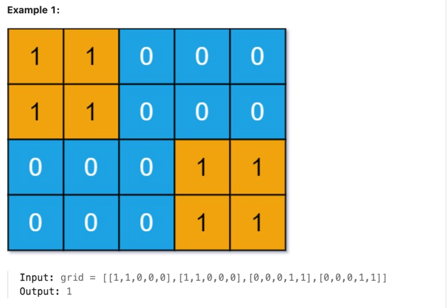
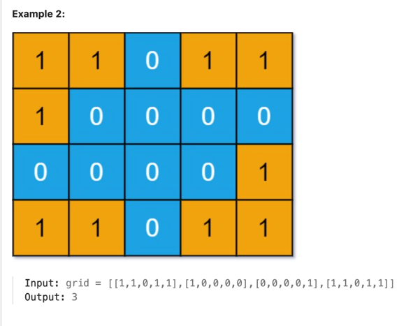

You are given an m x n binary matrix grid. An island is a group of 1's (representing land) connected 4-directionally (horizontal or vertical.) You may assume all four edges of the grid are surrounded by water.

An island is considered to be the same as another if and only if one island can be translated (and not rotated or reflected) to equal the other.

Return the number of distinct islands.

Constraints:

m == grid.length
n == grid[i].length
1 <= m, n <= 50
grid[i][j] is either 0 or 1.